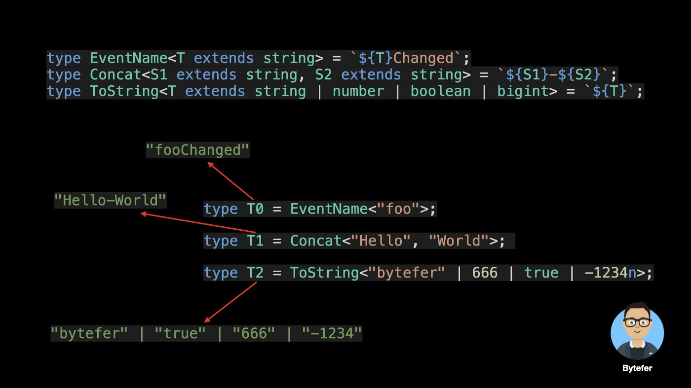
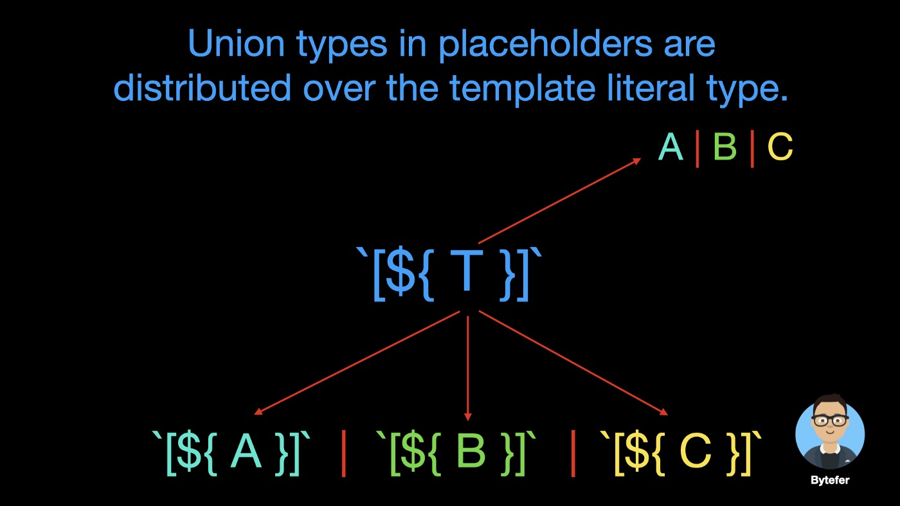
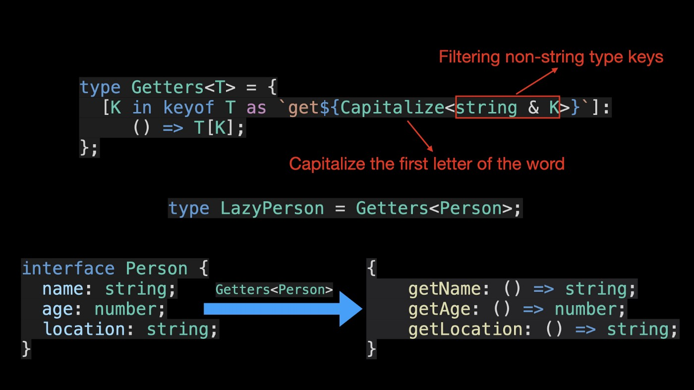

## 1.6 模版文字类型

<p align='center'>
  
</p>
<br/>

##### 介绍

在前端开发中，我们通常使用工具提示或弹出框组件来显示一些提示消息或说明性信息。为了满足不同的使用场景，工具提示或弹出框组件将允许用户设置其放置位置。例如，顶部、底部、左侧、右侧等。


由于字符串文字类型基本上可以对字符串值进行拼写检查，因此我们使用 TypeScript 的类型别名定义一个 Side 类型。

```typescript
type Side = "top" | "right" | "bottom" | "left";
let side: Side = "rigth"; // Error
// Type '"rigth"' is not assignable to type 'Side'.
// Did you mean '"right"'?ts(2820)
```

对于以上 4 个位置，已经可以满足大部分场景。但是，如果要更精确地设置工具提示的放置位置，例如，让工具提示显示在指定元素的左上角区域：

那么现有的 Side 类型就不能满足要求了，所以让我们定义一个新的展示位置类型：

```typescript
type Placement =
  | Side
  | "left-start"
  | "left-end"
  | "right-start"
  | "right-end"
  | "top-start"
  | "top-end"
  | "bottom-start"
  | "bottom-end";
```

在放置类型中，除了原来的 4 个位置外，我们还添加了 8 个新位置，例如“left-start”、“left-end”和“right-start”，它们对应于 8 种字符串文字类型。查看这些字符串文字类型，我们发现一些重复的代码“-start”和“-end”。此外，在定义这些字符串文本类型时，如果不小心，可能会出现拼写错误。
为了解决以上重复问题，因此 Typescript 4.1 出现新的模版文字类型。

```typescript
type Alignment = "start" | "end";
type Side = "top" | "right" | "bottom" | "left";
type AlignedPlacement = `${Side}-${Alignment}`;
type Placement = Side | AlignedPlacement;
```

看完上面的代码，你觉得简单多了？与 JavaScript 中的模板字符串类似，模板文本类型括在反引号中，可以包含 ${T} 形式的占位符。类型变量 T 的实际类型可以是字符串、数字、布尔值或 bigint。

模板文本类型为我们提供了连接字符串文本并将非字符串基元类型的文本转换为其相应的字符串文本类型的能力。以下是一些示例：


```typescript
type EventName<T extends string> = `${T}Changed`;
type Concat<S1 extends string, S2 extends string> = `${S1}-${S2}`;
type ToString<T extends string | number | boolean | bigint> = `${T}`;
type T0 = EventName<"foo">; // 'fooChanged'
type T1 = Concat<"Hello", "World">; // 'Hello-World'
type T2 = ToString<"bytefer" | 666 | true | -1234n>;
// "bytefer" | "true" | "666" | "-1234"
```

如果传入的 EventName 或 Concat 实用程序类型的实际类型是联合类型，结果会是什么？


```typescript
type T3 = EventName<"foo" | "bar" | "baz">;
// "fooChanged" | "barChanged" | "bazChanged"
type T4 = Concat<"top" | "bottom", "left" | "right">;
// "top-left" | "top-right" | "bottom-left" | "bottom-right"
```

对于模板文本类型，占位符中的联合类型分布在模板文本类型上。

```typescript
`[${A|B|C}]` => `[${A}]` | `[${B}]` | `[${C}]`
```



对于具有多个类型占位符的情况，例如 Concat 实用程序类型。多个占位符中的联合类型解析为交叉积。

```typescript
`${A|B}-${C|D}` => `${A}-${C}` | `${A}-${D}`
| `${B}-${C}` | `${B}-${D}`
```


在使用模板文字类型时，我们还可以通过以下方式使用 TypeScript 提供的内置实用程序类型来处理字符串类型，例如 Uppercase、Lowercase, Capitalize, and Uncapitalize。

```typescript
type GetterName<T extends string> = `get${Capitalize<T>}`;
type Cases<T extends string> =
  `${Uppercase<T>} ${Lowercase<T>} ${Capitalize<T>} ${Uncapitalize<T>}`;
type T5 = GetterName<"name">; // "getName"
type T6 = Cases<"ts">; // "TS ts Ts ts"
```

事实上，模板文字类型的能力非常强大。结合 TypeScript 的条件类型和推断关键字，我们还可以实现类型推断。

```typescript
type InferSide<T> = T extends `${infer R}-${Alignment}` ? R : T;
type T7 = InferSide<"left-start">; // "left"
type T8 = InferSide<"right-end">; // "right"
```

重新映射键（TS 4.1）
在 TypeScript 4.1 及更高版本中，您可以使用映射类型中的 as 子句重新映射映射类型中的键：

```typescript
type MappedTypeWithNewKeys<T> = {
  [K in keyof T as NewKeyType]: T[K];
  // ^^^^^^^^^^^^^
  // New Syntax！
};
```

您可以利用模板文本类型等功能从以前的属性名称创建新的属性名称：

```typescript
type Getters<T> = {
  [K in keyof T as `get${Capitalize<string & K>}`]: () => T[K];
};
interface Person {
  name: string;
  age: number;
  location: string;
}
type LazyPerson = Getters<Person>;
// {
// getName: () => string;
// getAge: () => number;
// getLocation: () => string;
// }
```



类型中的字符串联合
当基于类型内的信息定义一个新的字符串时, 模板文字的力量就来了
例如:

```typescript
// 类型别名
// on 方法,修改类型参数 Type 属性名称
type PropEventSource<Type> = {
on(eventName:`${string & keyof Type }Changed`, callback:(newValue:any) => void ) : void
}

// decalre 声明类型, 函数返回交叉类型
// 其中 PropEventSource 类型中有 on 方法
declare function makeWatchedObject<Type>(obj:Type): Type & PropEventSource<Type>

// 调用函数
const person = makeWatchedObject({
firstName: 'Saoirse',
lastName: 'Ronan',
age: 26
})
/_
person 返回的类型
const person:
{
firstName: string;
lastName: string;
age: number;
} & PropEventSource<{
firstName: string;
lastName: string;
age: number;
}>
_/

// 调用 on 方法监听属性变更
person.on('firstNameChanged',(newValue) =>{
console.log(`firstName 值变为了${newValue}`)
})
```

##### Uppercase<StringType>

```typescript
type Greeting = "Hello, world";
type ShoutyGreeting = Uppercase<Greeting>;

//type ShoutyGreeting = "HELLO, WORLD"

type ASCIICacheKey<Str extends string> = `ID-${Uppercase<Str>}`;
type MainID = ASCIICacheKey<"my_app">;

// type MainID = "ID-MY_APP"
```

##### Capitalize<StringType>

```typescript
type Greeting = "Hello, world";
type QuietGreeting = Lowercase<Greeting>;

//type QuietGreeting = "hello, world"

type ASCIICacheKey<Str extends string> = `id-${Lowercase<Str>}`;
type MainID = ASCIICacheKey<"MY_APP">;

// type MainID = "id-my_app"
```

##### Uncapitalize<StringType>

```typescript
type LowercaseGreeting = "hello, world";
type Greeting = Capitalize<LowercaseGreeting>;

//type Greeting = "Hello, world"
```

##### Lowercase<StringType>

type UppercaseGreeting = "HELLO WORLD";
type UncomfortableGreeting = Uncapitalize<UppercaseGreeting>;

//type UncomfortableGreeting = "hELLO WORLD"

```
##### 参考文献：
[● Using TypeScript Template Literal Types Like a Pro](https://medium.com/javascript-in-plain-english/how-to-use-typescript-template-literal-types-like-a-pro-2e02a7db0bac)
[● https://www.jianshu.com/p/a8a6e83ff2c7](https://www.jianshu.com/p/a8a6e83ff2c7)
[● typescriptlang.org/docs/handbook/2/template-literal-types.html](http://typescriptlang.org/docs/handbook/2/template-literal-types.html)


```
