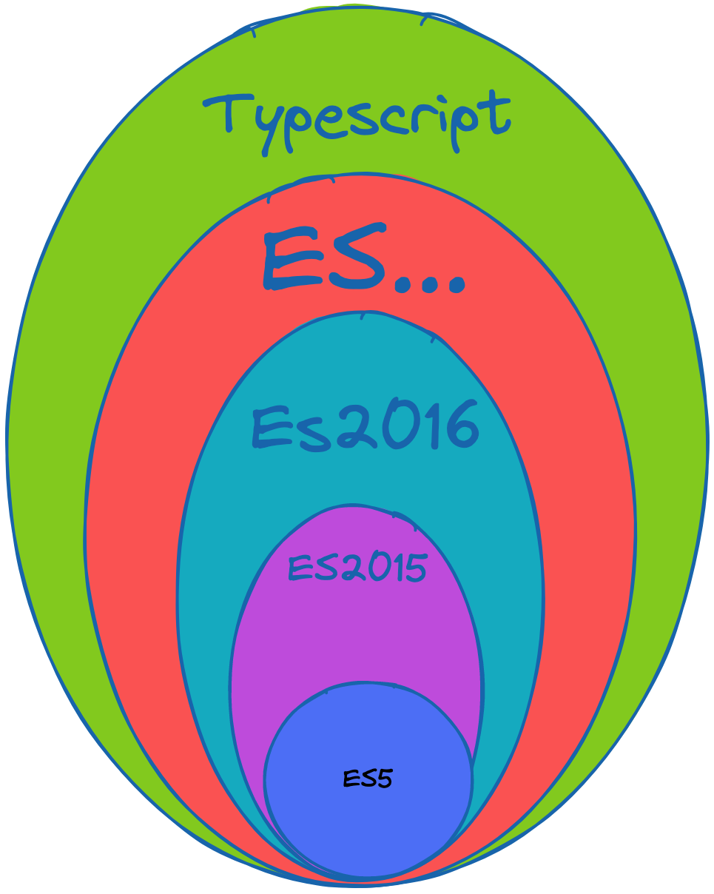

# Typescript 基础知识回顾

## 一、什么是 typescript？

TypeScript 是一种由微软开发的自由和开源的编程语言。它是 JavaScript 的一个超集，而且本质上向这个语言添加了可选的静态类型和基于类的面向对象编程。

TypeScript 提供最新的和不断发展的 JavaScript 特性，包括那些来自 2015 年的 ECMAScript 和未来的提案中的特性，比如异步功能和 Decorators，以帮助建立健壮的组件。下图显示了 TypeScript 与 ES5、ES2015 和 ES2016 之间的关系：

### 1.1 typescript 与 javascript 区别

|                   TypeScript                   |                  JavaScript                  |
| :--------------------------------------------: | :------------------------------------------: |
| JavaScript 的超集用于解决大型项目的代码复杂性  |        一种脚本语言，用于创建动态网页        |
|          可以在编译期间发现并纠正错误          |   作为一种解释型语言，只能在运行时发现错误   |
|           强类型，支持静态和动态类型           |           弱类型，没有静态类型选项           |
| 最终被编译成 JavaScript 代码，使浏览器可以理解 |            可以直接在浏览器中使用            |
|              支持模块、泛型和接口              |            不支持模块，泛型或接口            |
|       社区的支持仍在增长，而且还不是很大       | 大量的社区支持以及大量文档和解决问题的支持｜ |

## 一、typescript 是什么?

## 二、typescript 基础类型

## 三、typescript 断言

## 四、类型守卫

## 五、联合类型和类型别名

## 六、交叉类型

## 七、typescript 函数

## 八、typescript 数组

## 九、typescript 对象

## 十、typescript 接口

## 十一、typescript 类

## 十二、typescript 泛型

## 十三、装饰器

## 十四、typescript4.0 特性

## 十五、编译上下文

## 十六、typescript 开发辅助函数

## 十七、参考工具
